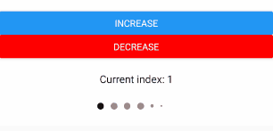

# react-native-pins

[](https://www.npmjs.com/package/react-native-pins)
[](https://npmjs.org/package/react-native-pins)
[](https://npmjs.org/package/react-native-pins)

<br />


The pins come with a shake animation and configurable 
device vibration.

## Install

To get started install via npm:
```sh
 npm install react-native-pins
```

#### Usage

Import:
```js
 import { Pins } from 'react-native-pins';
```

Then add it to your code:
```js
<Pins
    onRef={ref => (this.pins = ref)}
    numberOfPins={5}
    numberOfPinsActive={2}
    numberOfPinsMaximum={2}
    activeOnly
/>
```

The `<Pins />` has a `shake()` method which can be called through a reference `this.pins.shake()`.
This will perform a shake animation and vibration if enabled. A callback can be passed through props which
will be fired when the animation is complete. See props below.

#### Pins

| Prop            | Type          | Optional  | Default              | Description                                                                             |
| --------------- | ------------- | --------- | -------------------- | --------------------------------------------------------------------------------------- |
| onRef           | any           | Yes       |                      | onRef allows you to call the `shake()` method.                                          |
| activeOnly      | booolean      | yes       | false                | Whether to only fill the active pin or to fill all of them.                             |
| spacing         | number        | yes       | 15                   | The space between the pins                                                              |
| pinSize         | number        | yes       | 18                   | The size of the pins                                                                    |
| numberOfPins    | number        | Yes       | 5                    | Number of pins to render.                                                               |
| numberOfPinsActive | number     | Yes       | 0                    | Number of active pins. You can pass the `pin.length` here.                              |
| vibration       | bool          | Yes       | true                 | Should vibration be enabled on shake?                                                   |
| animationShakeCallback | func   | Yes       |                      | A callback triggered when the pin shake animation has finished.                         |
| containerStyle  | object        | Yes       | See Pins.js      | Style applied to PINS container.                                                        |
| pinStyle        | object        | Yes       | See Pins.js      | Style applied to each circle PIN.                                                       |
| pinActiveStyle  | object        | Yes       | See Pins.js      | Style applied to each circle PIN when it is active.                                     |
| numberOfPinsMaximum | number    | Yes       |                      | The max number of large pins.                                                           |

## Contributors ✨

Thanks goes to these wonderful people ([emoji key](https://allcontributors.org/docs/en/emoji-key)):

<!-- ALL-CONTRIBUTORS-LIST:START - Do not remove or modify this section -->
<!-- prettier-ignore-start -->
<!-- markdownlint-disable -->
<table>
  <tr>
    <td align="center"><a href="http://www.lukebrandonfarrell.com"><br /><sub><b>Luke Brandon Farrell</b></sub></a><br /><a href="https://github.com/aspect-apps/react-native-pins/commits?author=lukebrandonfarrell" title="Code">💻</a> <a href="https://github.com/aspect-apps/react-native-pins/commits?author=lukebrandonfarrell" title="Documentation">📖</a></td>
    <td align="center"><a href="https://github.com/rodriigovieira"><br /><sub><b>Rodrigo Vieira
    </b></sub></a><br /><a href="https://github.com/aspect-apps/react-native-pins/commits?author=rodriigovieira" title="Code">💻</a></td>
    <td align="center"><a href="https://https://github.com/Denise-Ng"><br /><sub><b>Denise Ng</b></sub></a><br /><a href="https://github.com/aspect-apps/react-native-pins/commits?author=Denise-Ng" title="Code">💻</a></td>
  </tr>
</table>

<!-- markdownlint-enable -->
<!-- prettier-ignore-end -->
<!-- ALL-CONTRIBUTORS-LIST:END -->

This project follows the [all-contributors](https://github.com/all-contributors/all-contributors) specification. Contributions of any kind welcome!
## License

This project is licensed under the MIT License
